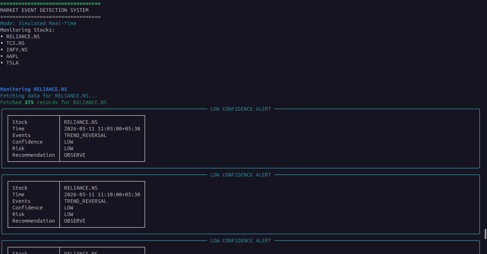
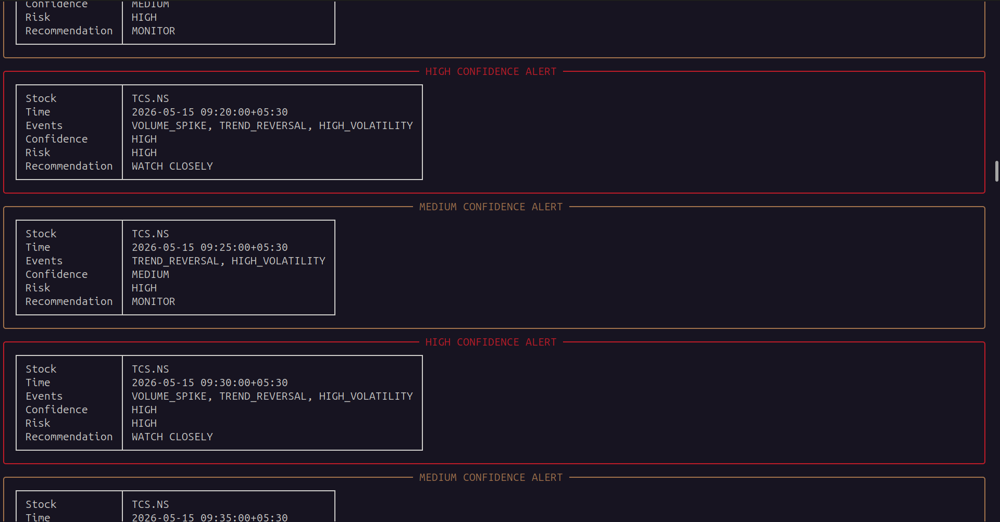
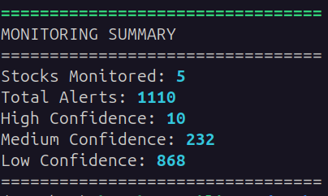
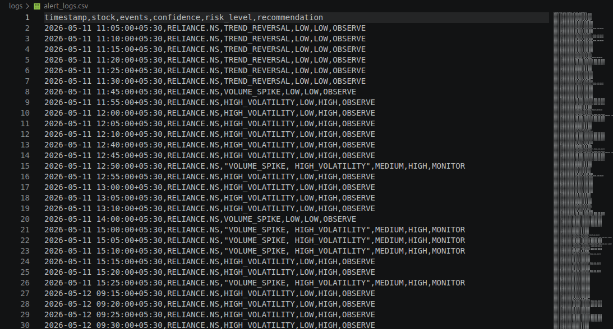
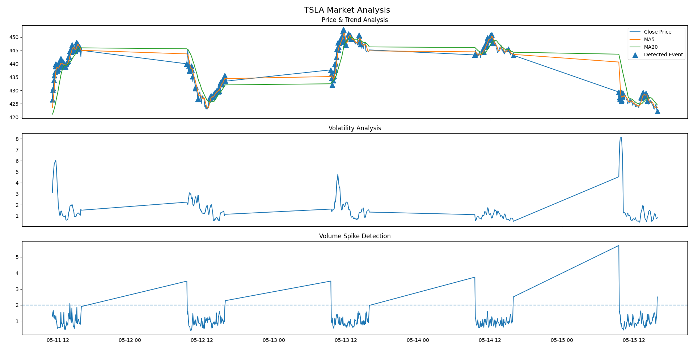

# Intelligent Market Event Detection & Alert System

A Python-based **real-time inspired financial monitoring system** that detects market events using threshold-based analytical algorithms, sequential market replay, and multi-factor confidence scoring.

The system ingests historical stock market data, simulates a live streaming environment, analyzes financial indicators, detects meaningful market events, and generates intelligent alerts with confidence levels and risk assessment.

---


## Project Motivation

Traditional stock monitoring requires continuously observing multiple stocks and manually identifying unusual behavior such as:

- Sudden price spikes
- Unusual trading volume
- Trend reversals
- High volatility conditions

This project automates market observation using **algorithmic event detection and financial signal analysis**.

Instead of predicting stock prices, the system focuses on:

>**Signal generation, event detection, risk monitoring, and decision intelligence**

---

## Key Features

### Real-Time Inspired Market Monitoring
- Simulates **live market streaming** using historical stock replay.
- Processes market data sequentially to mimic real-time market behavior.

### Financial Signal Detection
Detects meaningful market events using threshold-based algorithms:

#### Price Spike Detection
Detects sudden abnormal market movement.
Example:

>Price Change > 3%

#### Volume Spike Detection
Detects unusual trading activity.
Example:
>Current Volume > 2× Average Volume

#### Trend Reversal Detection
Uses moving average crossover logic.
Example:
>MA5 > MA20

#### High Volatility Detection
Identifies unstable market conditions and elevated risk.


#### Multi-Factor Confidence Scoring

Instead of triggering alerts on isolated conditions, the system combines multiple signals to reduce false positives.

### Confidence Levels:


|Signals Detected	|Confidence|
|-------------------|----------|
| 1 Signal	| LOW |
|2 Signals	|MEDIUM|
|3+ Signals	|HIGH|

### Risk Assessment

The system classifies detected events into:

1. `LOW` Risk
2. `MEDIUM` Risk
3. `HIGH` Risk

Based on market conditions and signal composition.


### Professional Monitoring Terminal

Built using rich for visually structured alert monitoring.

## Features:

- Color-coded alerts
- Confidence-based severity
- Professional monitoring interface
- Structured event display
- Event Logging

### All detected events are logged into CSV format for:

- Traceability
- Historical analysis
- Monitoring summaries
- Post-event inspection
- Financial Analytics Visualization



### Generates analytical charts for:

- Price movement
- Moving averages (MA5 / MA20)
- Volatility analysis
- Volume spike detection
- Market event overlays



## System Architecture

Yahoo Finance API
        ↓
Data Ingestion Layer
        ↓
Indicator Engine
(MA, Volatility, Volume Analysis)
        ↓
Event Detection Engine
(Threshold Logic)
        ↓
Confidence Engine
(Multi-Factor Scoring)
        ↓
Alert Manager
(Terminal + Logging)
        ↓
Visualization Layer
(Charts & Analytics)


### Technologies Used

- Programming Language : Python

Libraries : pandas, numpy, matplotlib, yfinance, rich


## How to Run

1. Clone repository:
```
git clone <repo-url>
cd market-event-detection-system
```

2. Create virtual environment:
```
python3 -m venv .venv
```

3. Activate environment:
```
Linux/macOS
source .venv/bin/activate
```

4. Install dependencies:

```
pip install -r requirements.txt
```

5. Run Project
```
python main.py
```

### Future Enhancements : 
- Real-time WebSocket market streaming
- Machine Learning-based anomaly detection
- Sentiment-aware market signals
- Interactive dashboard
- Configurable alert rules
- Backtesting engine
- Portfolio monitoring support
- Learning Outcomes

### This project helped strengthen understanding of:

- Financial market signal processing
- Analytical system design
- Threshold engineering
- Multi-factor event detection
- Python-based data analysis
- Real-time inspired architectures
- Monitoring systems and observability

# Disclaimer
This system is built for educational and analytical purposes only and should not be considered financial advice or used for live trading decisions.